# V22・熱血旅行風格・左右對頁預覽

討論用預覽：已改為鮮明的城市冒險／貼紙拼貼風格，火車圖案已移除，24 款插圖各使用一次。字體採用 K，行程內容保留。

迪士尼海洋插圖已改為達菲與星黛露。

每張圖片對應手冊翻開時的左右兩面；第一張為封底與封面攤開。全部 24 頁共 12 張圖片。

[下載完整 PDF・朋友確認版](tokyo-handbook-v22-review.pdf)（24 頁，約 7 MB）

螃蟹滿更正為「蟹まみれ TOKYO 池袋店」。已刪除錯誤菜單 QR；四個價格依旅客提供的近期網路分享，以紅字標示待確認。旅客熱線與插座電壓已移除錯誤的「法文」標示，保留原繁體中文網址。

## 01｜封底＋封面

[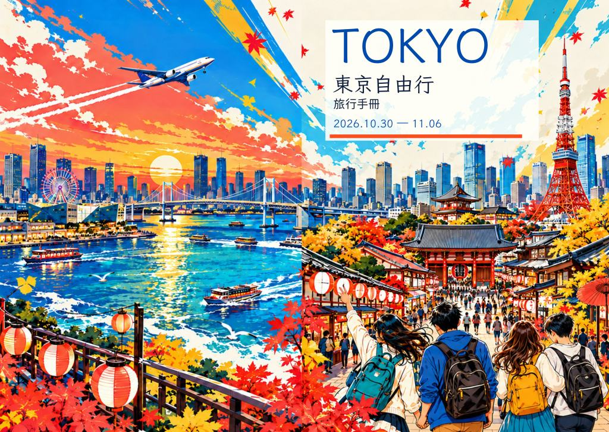](large-01.jpg)

## 02｜富士山開場＋八天總覽

[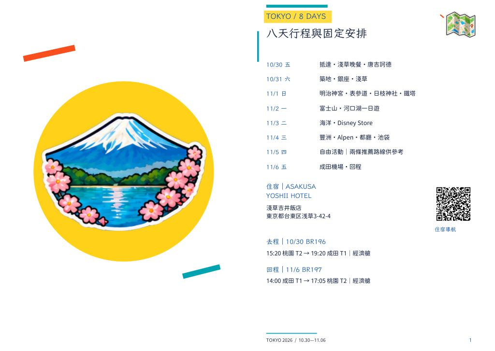](large-02.jpg)

## 03｜第一晚行程

[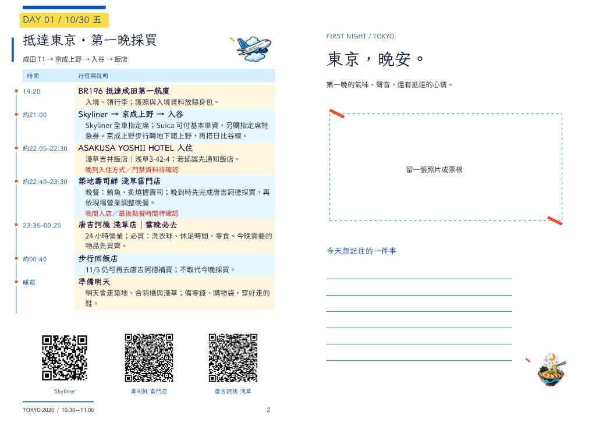](large-03.jpg)

## 04｜10/31 行程＋導航

[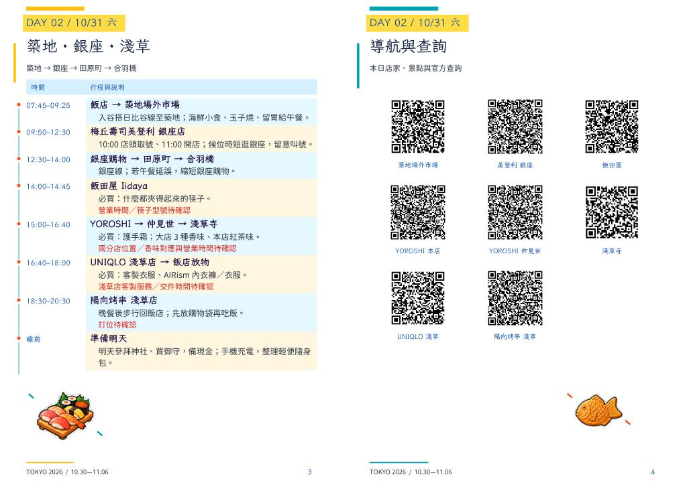](large-04.jpg)

## 05｜11/1 行程＋導航

[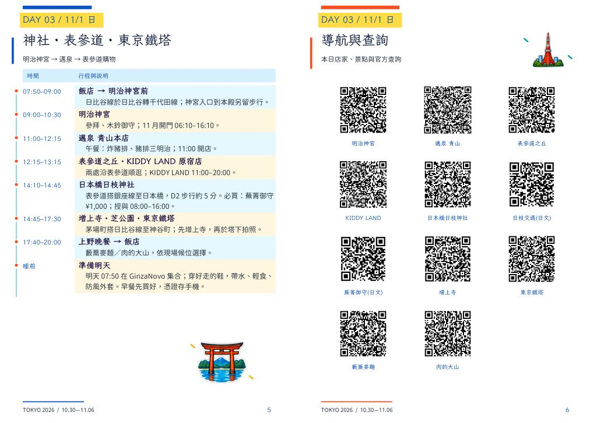](large-05.jpg)

## 06｜富士山＋迪士尼海洋

[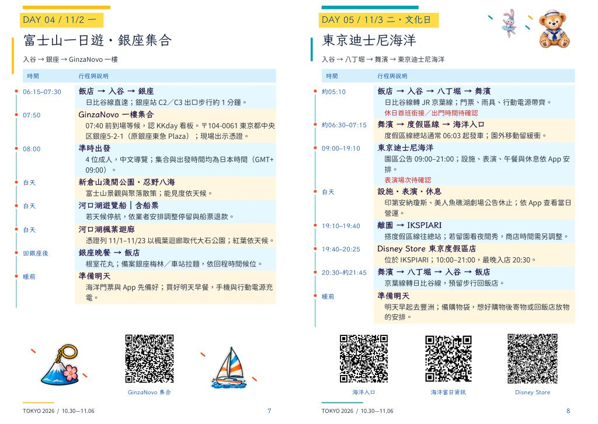](large-06.jpg)

## 07｜11/4 行程＋導航

[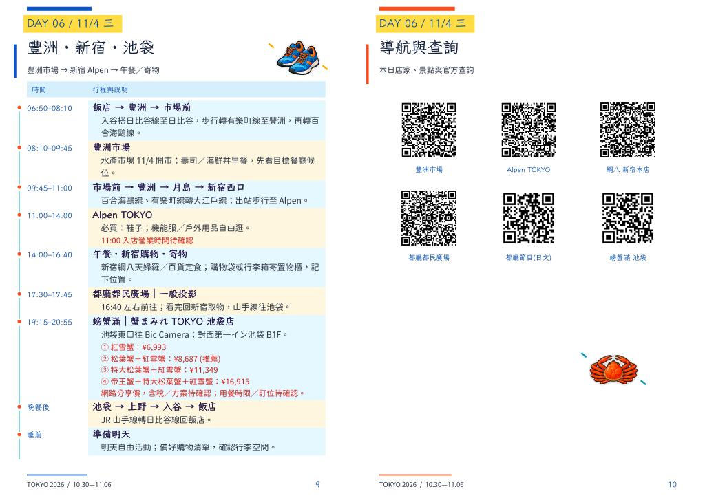](large-07.jpg)

## 08｜自由活動行程＋導航

[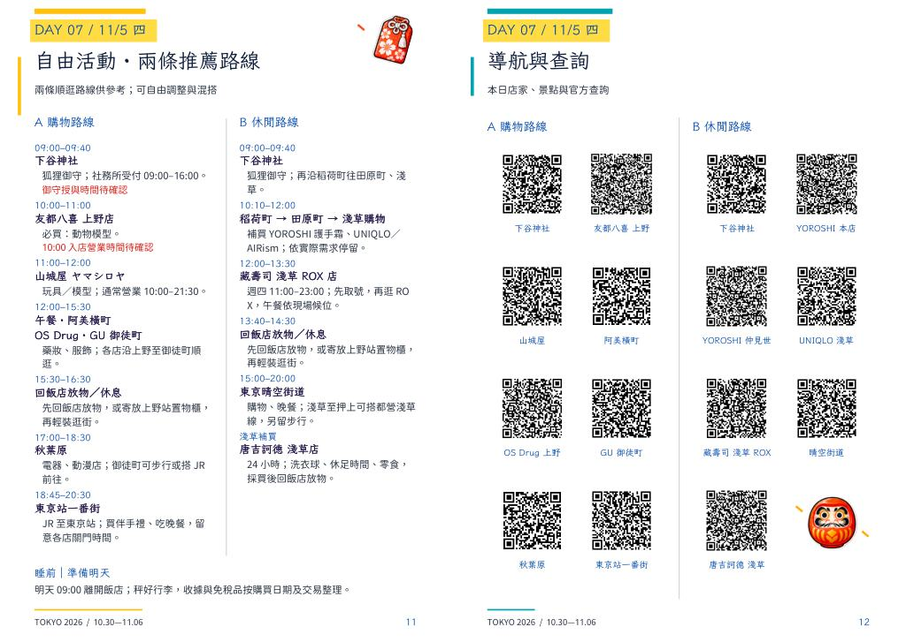](large-08.jpg)

## 09｜回程＋日圓建議

[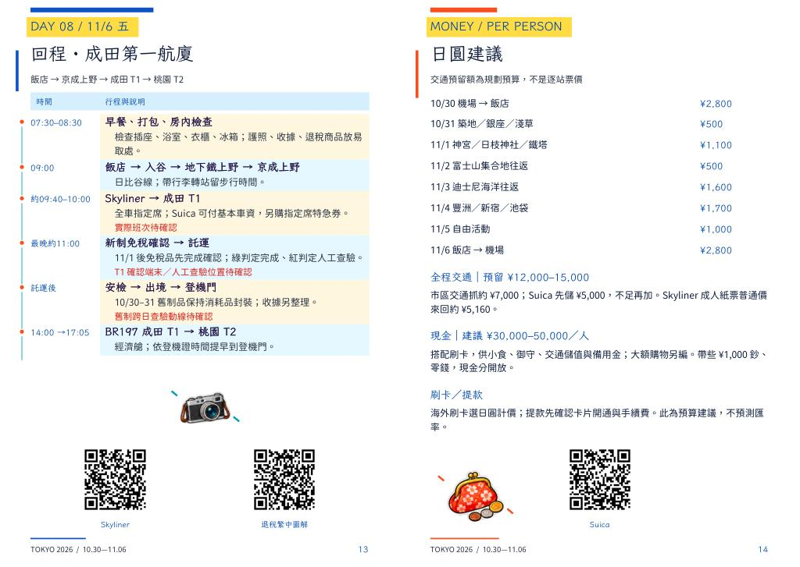](large-09.jpg)

## 10｜行李規定＋退稅對照

[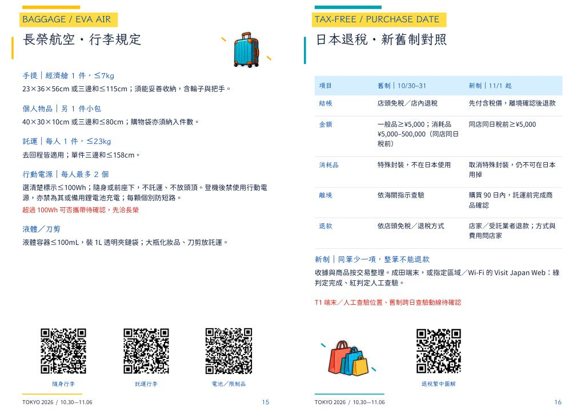](large-10.jpg)

## 11｜攜帶核對表＋緊急聯絡

[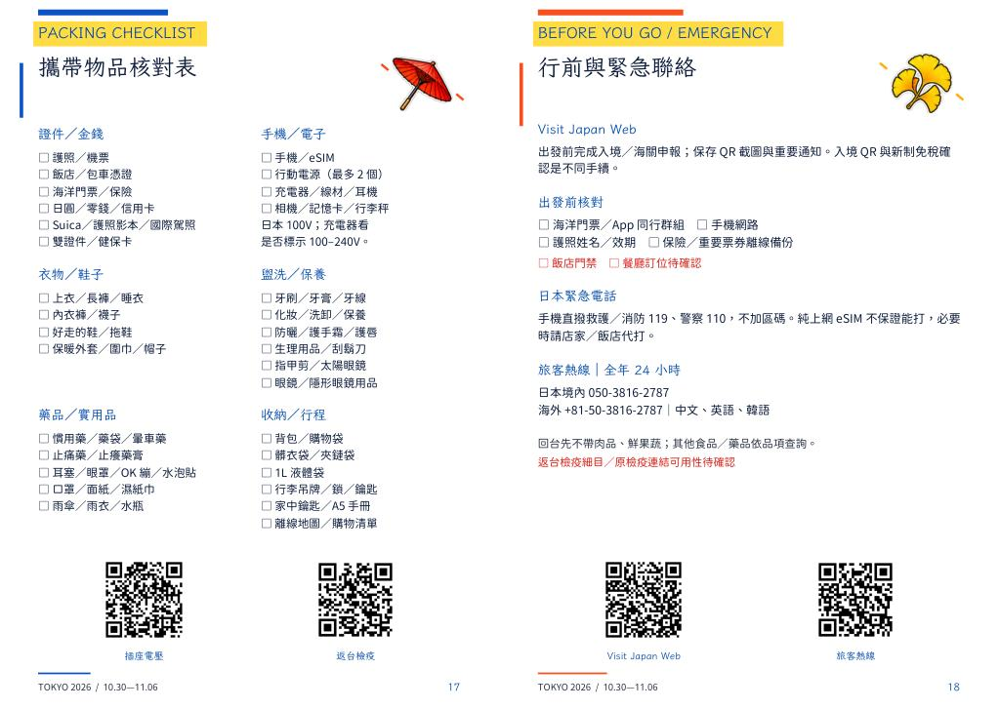](large-11.jpg)

## 12｜旅程回憶＋票根收藏

[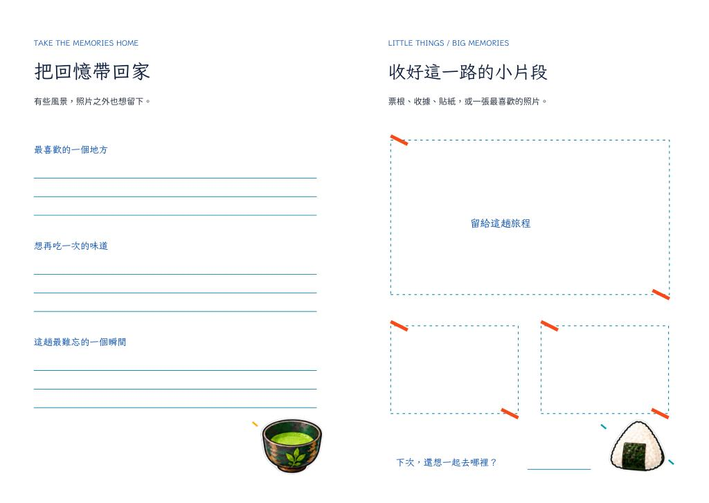](large-12.jpg)

