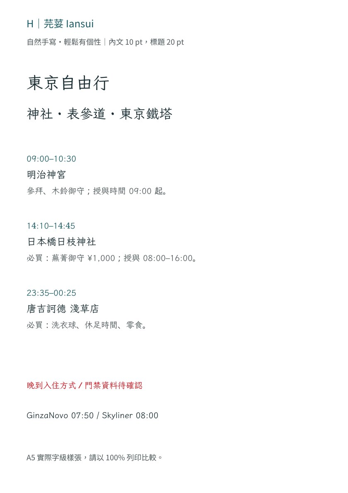
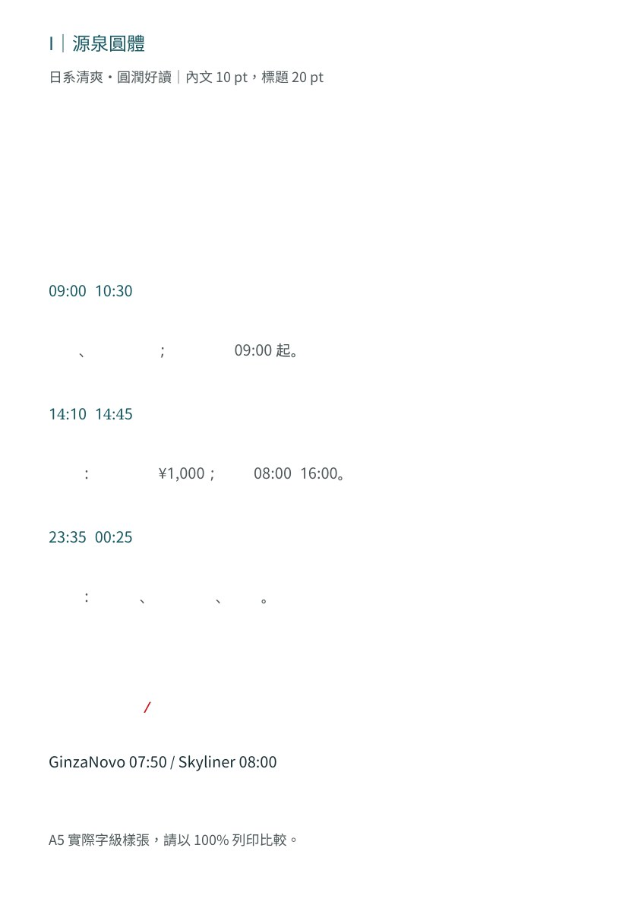
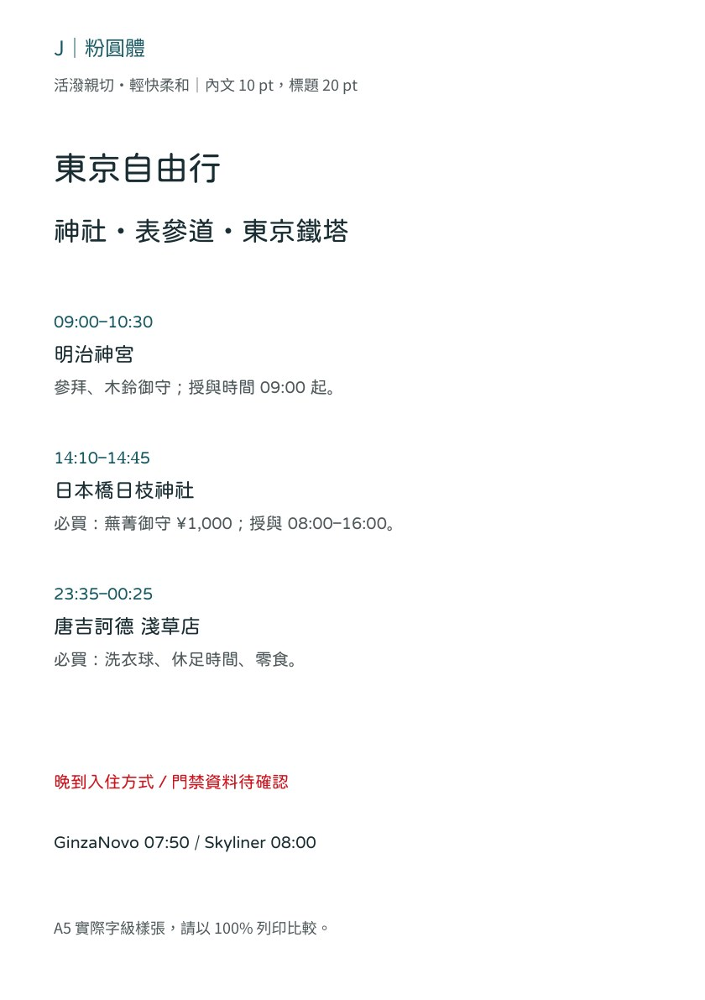
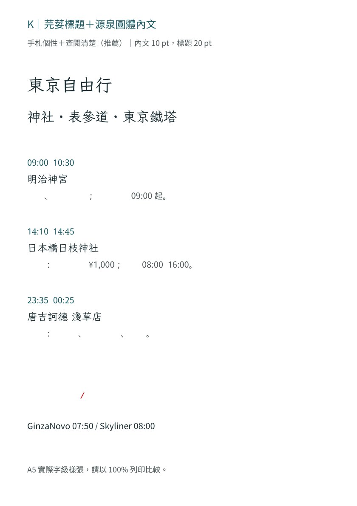

# 年輕旅行手冊字體預覽

同一段文字以相同字級製作，這是字體比較樣張，並非新版手冊。

[下載 A5 實際字級樣張](youthful-fonts-a5.pdf)；列印請選 100%。

## H｜芫荽 Iansui

自然手寫・輕鬆有個性

## I｜源泉圓體

日系清爽・圓潤好讀

## J｜粉圓體

活潑親切・輕快柔和

## K｜芫荽標題＋源泉圓體內文

手札個性＋查閱清楚（推薦）

